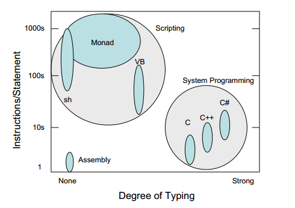

# Chapter 2 - Problem

Windows has simple GUI administrative tools for basic users (Control Panel, MMC, etc). Windows also has a rich set of languages, APIs[^1] and object models for advanced systems programmers ([C](http://bit.ly/1SmIDVh), [C++](http://bit.ly/1HmcYe5), [C#](http://bit.ly/1EngdQ6), [WMI](http://bit.ly/1ekpnrY), [Win32](http://bit.ly/1IORfB2), .Net, etc). What is missing is the vital middle – administrator-oriented composable tools to type commands and automate management. The vital middle is typically addressed by scripting languages.

Our current scripting solutions ([WSH](http://bit.ly/1ekpvra), [VB](http://bit.ly/1Q0VwjT)) focus on the high end of the scripting world which manage the platform using very low level abstractions such as complex object models, schema, and APIs[^2]. This is effectively systems programming and misses much of the admin community. Admin scripting flows from command line admininstration[^3], it must be small, simple, incremental, and deal with very high levels of abstraction.

[John Ousterhout](http://web.stanford.edu/~ouster/cgi-bin/home.php) described the distinction between scripting and systems programming well in his paper [Scripting: Higher Level Programming for the 21st Century](http://web.stanford.edu/~ouster/cgi-bin/papers/scripting.pdf).

[Ousterhout](http://web.stanford.edu/~ouster/cgi-bin/home.php) posits that scripting allows for “gluing” applications together – a higher level abstraction than system programming – enabling (even) more rapid application development than today’s systems programming languages. The fundamental argument is that we should continue to ride [Moore’s Law](http://www.mooreslaw.org) to move development to higher levels of abstraction via script. To enable administration automation in the mainstream, administrators need a comprehensive and scriptable shell and utilities and the [administrative GUIs](https://notgartner.wordpress.com/2008/02/23/how-to-host-the-powershell-runtime/) need to be layered on top of this infrastructure[^4]. This will enable efficient training of administrators on command line automation, ensure comprehensive administrative capabilities at the command line, and the economies of scale of an admin-composable automation model.
___
**Notes**

[^1]: APIs in fact, are the main differentiator between Windows and [Linux/UNIX](http://www.cyberciti.biz/faq/what-is-the-difference-between-linux-and-unix/) systems. On Linux/UNIX, everything essentially looks like a folder or a file, and nearly every bit of configuration is in a loosely-structured text file. Automating administration in that environment is easy, because you only have one API: text files. Windows is harder because to do anything, you've got to learn that something's API - and all the APIs are different. Knowing how to add a user to [Active Directory](https://technet.microsoft.com/en-us/library/hh852274%28v=wps.630%29.aspx) doesn't help you create a site in [SharePoint](https://technet.microsoft.com/en-us/library/ff678226.aspx) - they're all different APIs.

[^2]: Misses, in other words, the point, because [VBScript](https://msdn.microsoft.com/en-us/library/d1wf56tt%28v=vs.84%29.aspx) is basically a simplified way of dealing with APIs that were meant for developers. VBScript also assumes that product teams have created dedicated, VBScript-compatible APIs, which most didn't. Getting anything done with VBScript was often complicated, and always hit-or-miss.

 [^3]: (ORIGINAL) Administrative scripting is often the progression from [ad hoc](https://en.wikipedia.org/wiki/Ad_hoc) scripts to automated operations. Admins notice that they type the same commands over and over again so they build a script. The notice that their scripts contain lots of the same things so they produce [parameterized subroutines](https://technet.microsoft.com/en-us/magazine/jj554301.aspx) and progress from there.
 
 [^4] Snover felt strongly about layering GUIs on top of command-line. That's in part because it's how many Linux/UNIX administrative GUIs do things, but it's mostly because doing it that way forces you to ensure that everything _can be done from the command-line_. The GUI doesn't become a special class of citizen holding special, unique powers; it's just another consumer of the command-line. The command-line, in turn, can be much more easily consumed by other consumers than a GUI could be.
