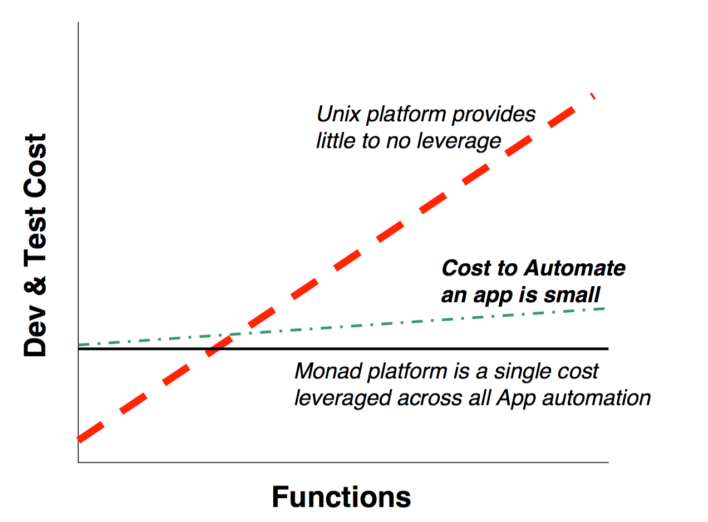
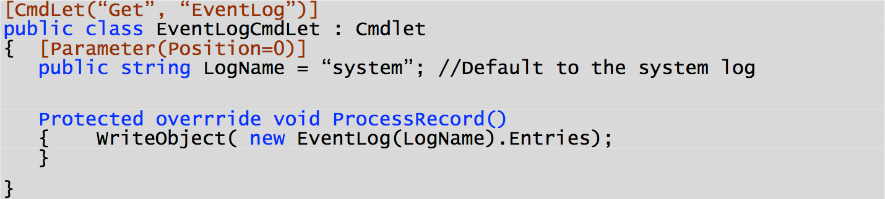
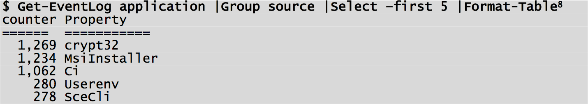
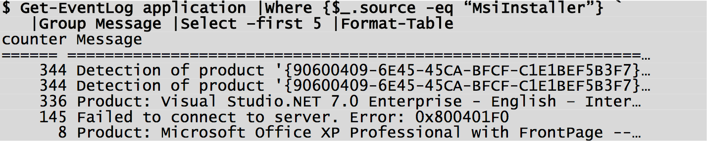
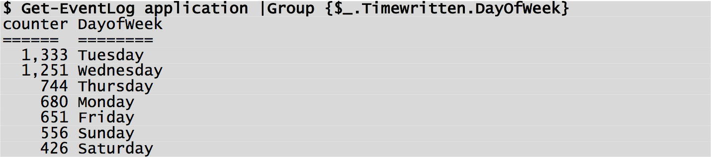

#Chapter 5 - The Monad Automation Model (MAM)
___
Monad defines a highly leveraged automation model for applications.  The model factors out common functions so they can be implemented once in the runtime environment.  This provides both leverage for the developer and consistency for the administrators. The incremental cost to develop and test application-specific functions is quite low compared to the traditional methods.

Developers express an automation model to Admins as a set of user-friendly nouns and verbs.  The developer implements these by subclassing a set of base automation .Net classes and annotating them with automation attributes to produce a set of Cmdlets.  The MSH engine exposes these Cmdlets as APIs and a set of commands.  Administrators and tool developers now get a mainstream way to uniformly access the automation of every aspect of the operating system.

## _5.1 - An Example_

Imagine the developer who needs to expose the Windows eventlog for reporting automation.  The developer decides how to structure the automation in terms of nouns and verbs ("Get-EventLog").  Monad provides strong guidance on this subject.  The developer then writes a CmdLet (in C#, VB.NET, COBOL, etc) to expose this function.

A CmdLet might look like this[^5-1]:

At first glance it might appear that the Admin is not going to get much use from this code but nothing could be further from the truth.  Using the CmdNoun and CmdVerb attributes automatically registers this CmdLet as the command *"Get-EventLog"* with a single parameter *"LogName"*.  The Admin then uses this command along with a set of base utility commands to compose a rich set of scenarios:

_What is filling up my application log?_[^5-2]

_Why is MsiInstaller filling up my log?_

By changing the last CmdLet in the pipeline, this information can be output in XML, CSV, LIST, HTML, EXCEL or any other format.

_Is my eventlog usage regular across the week?_

The admin can add additional Cmdlets to the pipeline to filter out only those events that where generated on Tuesday and then find out which events occur most on that day `($ Get-EventLog application |Where {$\_.TimeWritten.DayofWeek -eq "Tuesday"} |Group EventID)`.   Having found that the most frequent event on Tuesdays, they can easy filter the log for that event and determine the distribution of that event across the days of the week. `($ Get-EventLog application |Where {$\_.EventID -eq 131080} |Group {$\_.TimeWritten.DayofWeek})`

Monad requires a small amount of CmdLet[^5-3] code to be integrated into the runtime environment and take advantage of its rich set of functions and utilities to provide a powerful and relevant set of administrative functions.  While this example focused on an _ad hoc_ investigation, it is obvious how this investigation could lead to a set of automated nightly reports.  This example is a narrow scenario; comprehensive Cmdlets would need to provide a full range of verbs, have the input extensively checked, and perform error handling.  Still, the savings in development and test are dramatic.

## _5.2 - Leveraging .Net_

Developers use .Net attributes to offload work to the runtime environment[^5-4]. The general philosophy of Monad is to implement things once and then use them everywhere.  A rich set of declarative attributes direct the Monad runtime to perform actions on behalf of the developer.  This transfers the responsibility for writing and testing this code as well as for interacting with the user during error conditions and producing and localizing error messages.

Monad defines automation attributes in the following areas:

| | |
| --- | --- |
| Parsing Guidance | These tell the parser how to map user input to the CmdLet Request Object.  E.g. how to map parameters to properties, or whether a qualifier is mandatory. |
| Data Generation | These tell the new shell to process the user input to generate the actual data.  E.g. filename globbing. There will also be globbers for hostnames, ipaddrs, registrykeynames, ProcessNames, etc. |
| Data Validation | These express validation rules on the input data.  E.g. cardinality of the data, the min/max values of the data, etc. |
| Encoding Directives | These convey how to encode the processed user input into data objects.  E.g. a CmdLet may want an array of StreamWriters instead of an array of filenames. |
| Object Processing | Perform a set of common functions on common datatypes.  E.g. perform a ToLower() on strings. |
| Visibility/Applicability | These provide predicates for visiblity/applicablity.  E.g. Cmdlets can be tagged with the Machine and User Roles.  If a machine does not have the DHCP Server Role, the DHCP server commands will not be visible by default. |
| Documentation | These provide utilities information about the element.  E.g. Help |
| Test | These provide hints to utilities to facilitate the auto generation of Test Vectors. |

---

_**Notes**_

[^5-1]: Briefly, during development, PowerShell's "script cmdlets" (now, "advanced functions") did have a syntax similar to this. In C#, cmdlet source code still looks a lot like this.

[^5-2]: ORIGINAL: "Get-EventLog application" is provided by the sample code above and the rest come from the Monad base commands.  "Group source" counts the number of objects that have the same value for a particular property (i.e. how many times did a particular source show up?).  "Select -First 5" truncates the set of objects to only have the first 5.  "Format-Table" formats the objects and their properties a table

[^5-3]: Note that even in this document, Snover wasn't consistent about "CmdLet" versus "Cmdlet." Today, "cmdlet" is the standard. His original idea was to emphasize that a "cmdlet" wasn't a "full command" with all the parsing and whatnot a traditional command implemented; instead, it was a portion of a command, with much of the overhead being provided by the automation engine's base classes.

[^5-4]: Meaning, a .NET developer can tell the .NET runtime to perform certain standardized tasks. You see this a lot in PowerShell: for example, a function can declare a parameter as mandatory, and the shell will enforce that attribtue rather than the function developer having to write logic to do so. 
