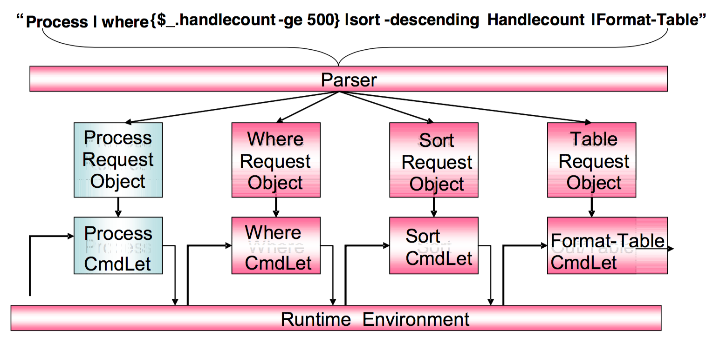
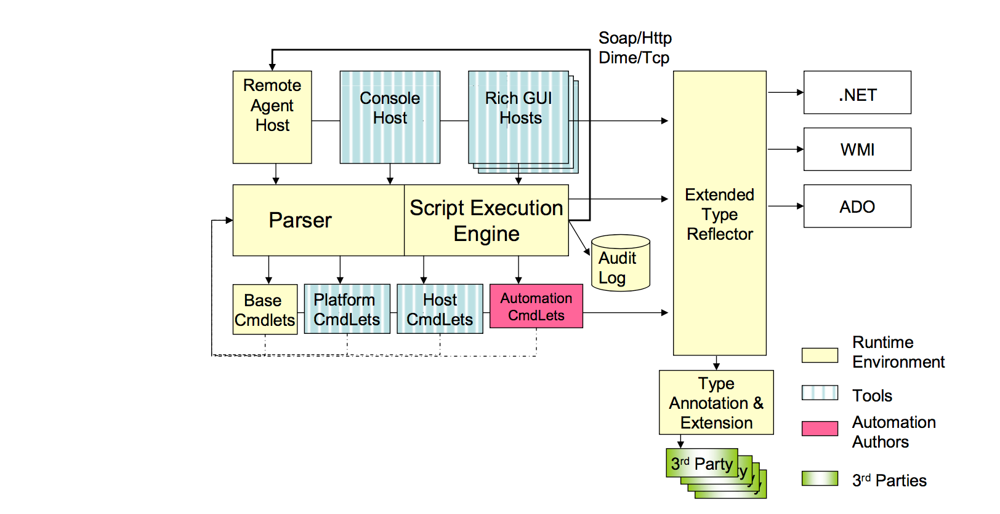

# Chapter 6 - The Monad Shell (MSH)
Monad provides a runtime environment for creating highly consistent, powerful, discoverable, and secure APIs, command lines and GUIs by creating pipelines of Cmdlets.  This capability is delivered as a .Net class which can be embedded in a number of "hosts" which expose this functionality to the user.  The term MSH refers to both the runtime environment and the host that exposes that to the use as a command line interactive shell.

## _6.1 - Pipelines of .Net Objects_
Monad takes user input, builds a pipeline of Cmdlets for each of the commands, parses and encodes the user input for each command into a CmdLet Request Object (CRO).  The script execution engine then sequences the pipeline.  The first Cmdlet is invoked and passed its CRO as a parameter.  This Cmdlet returns a set of .Net objects which are then processed and passed to the next Cmdlet along with its CRO and so on until the pipeline is complete.

Passing .Net objects to Cmdlets instead of text streams allows reflection-based utilities to provide a function for any .Net object.  In the example above, the **WHERE** CmdLet filters a set of objects based upon a test of those object's properties.  It takes objects of any type (e.g. Processes, Files, Disks, etc) and queries for its type using the .Net reflection APIs.  Using the Type, it queries for the existence of the property specified by the user ("HandleCount").  It uses this information to query each object for the value of that property and performs the test on that property and to filter the object appropriately.

The same mechanism is used by the **SORT** CmdLet to sort a set of objects and the **FORMAT-TABLE** CmdLet to display the properties of a set of objects as a table.  Monad's utilities facilitate factoring common functions out of the Cmdlets which saves costs for the developer and increases power/consistency for Administrators.

Integrating legacy commands[^6-1] is trivial because text streams are merely one type of .Net Object stream.  That said, once rendered into text, you lose the ability to operate upon it as a rich reflection-based object and are back into the world of prayer based parsing.

## _6.2 - Monad Runtime Environment Components_
The diagram below illustrates the major components of the Monad Runtime Environment:

#### 6.2.1.1 - The Parser
The Monad parser is used by all Cmdlets and ensures a consistent syntax.  It is responsible for parsing user input for the script execution engine.  When a user enters a command line, the Parser maps the command to a CmdLet method and it's Request Object.  The fields and attributes of the request object are used to parse the rest of the command line, generate any additional information (e.g. globbing), validate the input, and encode those values into the request object.

In performing this process, the parser augments the metadata provided by the Request Object with metadata provided by 3rd party policy providers.  For instance, a request object may indicate that it can accept up to 16 nodenames and that the names must resolve to an IPv4 address.  A policy can not change those directives but could add a directive indicating that the nodes must be currently responding to an ICMP ping (e.g. IsAlive).

#### 6.2.1.2 - The Script Execution Engine
The Monad script execution engine sequences the Cmdlets and ensures a consistent runtime experience.  It is responsible for taking the pipelines encoded by the parser and performing all the operations required to sequence them to completion.  If the actions need to occur on a remote machine or a set of remote machines, it coordinates with the [MRS](https://www.penflip.com/powershellorg/monad-manifesto-annotated/blob/master/chapter-8-the-monad-remote-script-mrs.txt).  It logs all activities to the audit log.  The execution engine looks at the incoming datastream and finds the correct properties to bind on a CmdLet (a CmdLet might have multiple parametersets to take advantage of different types of data).  The output from a CmdLet is then gathered, potentially processed (converted, batched, etc), and passed on to the appropriate properties of the next CmdLet.  Since the runtime environment can be embedded in multiple hosts (e.g. command line, GUI, etc.), it is important that a CmdLet never directly communication with the user.  The script execution engine mediates this activity between the CmdLet and the various hosts.

#### 6.2.1.3 - The Cmdlets
Cmdlets perform actions.  There are four types of Cmdlets: 1) Base 2) Host 3) Platform and 4) User.   **Base** Cmdlets will work in any .Net environment such as Sort, Where, Group etc.   **Platform** Cmdlets are those that are dependant upon a particular platform (XP, Smart Phone, or Compact Framework) and are not available on other platforms.   **Host** Cmdlets are those that are provided by the application that embeds the Monad runtime environment.  For instance msh.exe, or admin GUI that expose Cmdlets specific to that host (e.g. Change a font, close a window, etc).   **User** Cmdlets are those written by the User.  These can be written in any language (C#, VB.NET, etc) but most will be written in MSH (the shell language).

The unique identifier for these Cmdlets is their .Net Type (e.g. System.Command.ProcessCmdLet).  While this identifier can always be used to invoke the CmdLet, it is long and unfriendly.  As such, CmdLet authors are required to provide Friendly names through attributes.

It will be fairly common and easy for higher order Cmdlets to be implemented by getting a set of data and then using the Monad runtime to invoke a script on that data, and then returning the results of that script.

#### 6.2.1.4 - The Extended Type Reflector
The power of Monad is its ability to leverage .Net reflection.  The problem is that there are important objects that are encoded in ways that denude reflection of its power.  When you reflect against ADO datatables, you find out that they have a property called Columns.  What we need are the names of the columns but these are encoded as values.  A similar problem exists with WMI, Active Directory, and XML.  The extended type reflector is designed to address such issues.

#### 6.2.1.5 - The Type Annotation and Extension System
Dealing with raw objects provides both too much and too little information.  It is the job of the type annotation and extension system to resolve this paradox.  It provides a mechanism for 3rd parties to define sets of properties (e.g. properties associated with performance, configuration, resource consumption, or dependencies) and give the set a public name.  This allows the user to give a name instead of having to specify each and every property.  E.g. "Format-Table resources" vs. "Format-Table name ,pid, workingset, handlecount, virtualmemory, privatememory".

Monad provides access to objects and the methods on those objects.  However the intrinsic methods of an object represent a very small number of the interesting things that users want to do.  The type extension mechanism allows 3rd parties to register brokered methods on those objects.  These methods can be accessed using the same syntax as the native ones but this system will then dispatch them to the appropriate 3rd party method passing the original object as a parameter.

#### 6.2.1.6 - The Remote Agent
Users will be able to run scripts on remote machines via Web Service requests to Remote Agent host.  This host will embed the runtime and respond to requests received via Soap/HTTP or DIME/TCP.  Users will be authenticated and their activities authorized (either by ID or ROLE).  Requests and replies will be encoded in a way that allows cancellation and allow tracing local activities back to specific requests in remote audit logs.

When a script is complete, its return objects are serialized by value for transmission across the wire.

#### 6.2.1.7 - Security

Monad could well be one of the most secure shell environments ever created.  All interesting actions are recorded into an audit log.  The code identification facilities provided by .NET significantly reduce exposure to one of the most common security exposures in a shell environment: Trojans. Signing, strong names and hashes in system policy will be used to identify which utilities are legitimate and approved and also prevent known Trojans from being executed.

In sum, the Monad shell will provide both reduced security exposures and far better detection and remediation of security breaches.

#### 6.2.1.8 - MSH Host
MSH is a .Net assembly which can be embedded into any executable host to provide script execution and access to Cmdlets.  Hosts are able to determine which subset of Cmdlets are made available to the user.  The most common case will be that a Host exposes all Base Cmdlets (e.g. sort, where, etc), all of its Host Cmdlets (e.g. outlook would expose Cmdlets for dealing with mailboxes and messages), and an appropriate subset of the Platform Cmdlets (Cmdlets dealing with processes, disks, network adapters, etc).

MSH is also a stand alone executable which hosts the script execution engine and provides a rich interactive experience.  While providing a compelling vt100-type experience, MSH will leverage the capabilities of a PC to provide world class analytics.  MSH provides rich, graphical intellisense capabilities for command completion.  Data can be output in graphical formats to leverage the PCs interaction and visualization capabilities.

## _6.3 - MSH Scripting Language_
MSH provides a full featured scripting language using the functions and syntax of the POSIX Shell model (flow control, faulting handling, variables, function definition, scoping, IO redirection, etc) as a starting point.  These are then modified and expanded upon to either improve the programming experience, take advantage of new functionality or provide a glide path to C# .  The goal is that UNIX admins working with Windows will find it easy to learn and migrate their skills to MSH.

In addition to writing traditional functions, users can use the scripting capabilities of MSH to write their own Cmdlets and to add or override verbs to existing CmdLet Nouns.

___

**Notes**

[^6-1]: ORIGINAL: Msh will be able to seamlessly invoke legacy commands and legacy shells will be able to seamless invoke Msh CmdLets.  (Msh will provide a mechanism to export CmdLets for access from the legacy shells)
