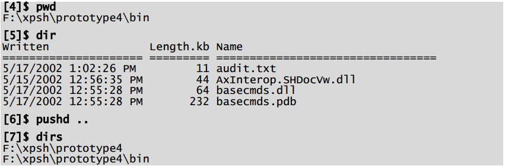
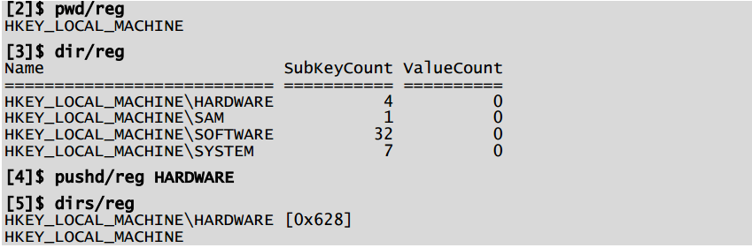

# Chapter 7 - The Monad Management Models (MMM)
Monad helps application developers design the administrative experience by providing a set of management models. A MMM is a rich set of scenario based automation base classes and a tool or set of tools that use those classes to perform a particular management scenario. These base classes cover the major management scenarios including: Navigation, Diagnostics, Configuration, Lifecycle, and Operations. The base classes provide a common way of performing these tasks across multiple resource types. This allows the admin to learn a model for managing a particular scenario and then apply that model to a wide range of problems and new situations. Developers pick the appropriate set of base classes, derive their own classes from these, and implement the appropriate methods for their resource types. The base classes provide the following:

1. A set of verbs for the scenario (e.g. Navigation has the verb set: pwd, cd, dir, pushd, popd, dirs)
2. A set of base request objects which define common qualifiers. E.g. If the scenario refers to a remote machine, the base request object would define a common qualifier -MACHINENAME. This discourages people from using the terms: NODE, SERVER, HOST, etc.
3. A set of exceptions and error messages for that scenario. E.g. There will be a standard schematized exception for “Resource unavailable” so that we don’t end up with dozens of variations [which exist today].
4. Common solutions to common scenario problems. E.g. the base classes will provide a standard solution to the problem of someone accidentally asking for too much information [get all objectsin LDAP].

Microsoft will localize all the user visible portions of these scenarios (Verbs, qualifiers, error messages, etc) so ISVs can significantly reduce their development costs by leveraging these base classes. In addition to these benefits, Monad provides UI controls to graphically display and interact with implementations of these base classes. Monad will ship with MMC plug-in tools that host these UI controls but ISVs or in-house developers can host the controls in their own management UIs. Since these controls will be accessing well defined and promulgated data and control interfaces, 3 rd parties can create replacement controls as well.

## An Example
Navigation provides a example of a Management Model. There will be a base class for all Cmdlets that want to do Navigation. This will define the verbs (pwd, cd, pushd, dirs, popd, dir), common error messages, and provide common implementations for common problems (pushd, dirs, and popd will be implemented once). That base class can then be subclassed to provide a consistent admin experience for a minimal amount of code. Once the admin learns how to use this model, they will be able to use to across a wide range of resources.
Navigating the filesystem will be the default case:

The same commands can be used to explore the Registry:

The same commands can be used to explore the Help system, Active Directory, SQL databases, WMI or other namespaces.

